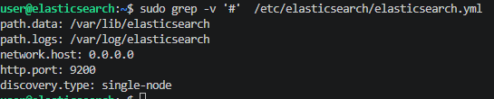
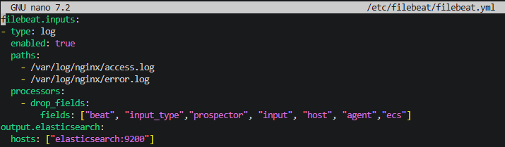
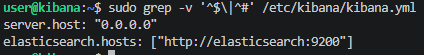
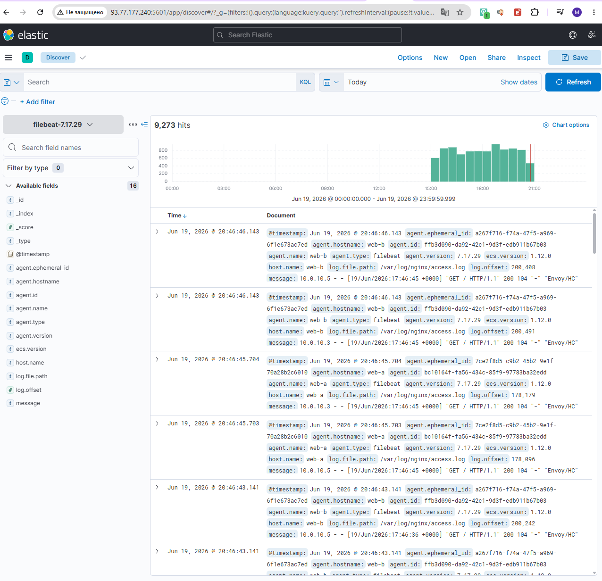
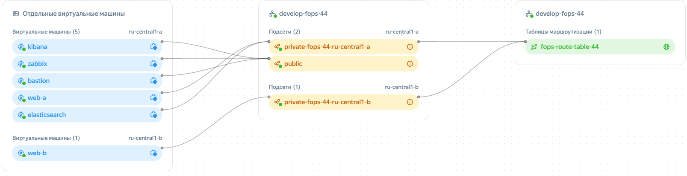
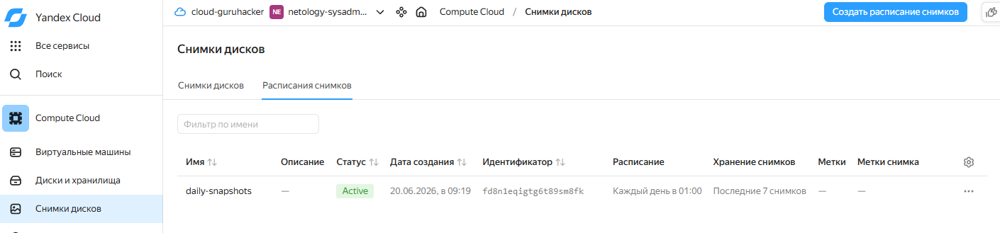
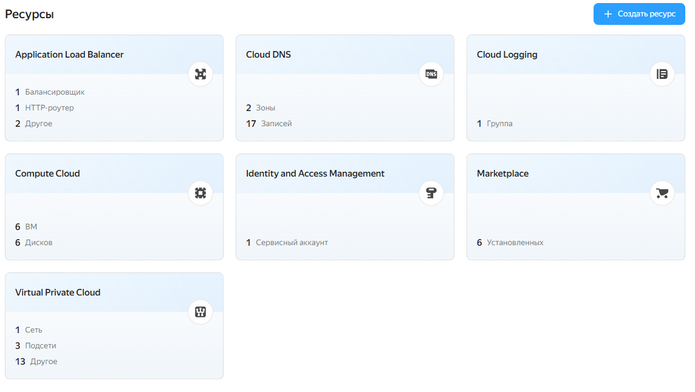

#  Курсовая работа на профессии "DevOps-инженер с нуля" - Клочек Максим

Задание в [Task.md](Task.md)

# Решение

## Установка и настройка доступа

- Устанавливаем terraform из зеркала https://hashicorp-releases.yandexcloud.net/terraform/ 
  - В Linux файл `terraform` из архива надо скопировать в `/user/local/bin`
- Файл с настройкой провайдера `.terraform` копируется в `/home/<user>`
- Для variables.tf: данные берутся со страницы https://console.yandex.cloud/folders/
- Ключ для подключения создаётся в меню сервисного аккаунта, надо выбрать `Создать авторизированный ключ`. Скаченный файл переместить в `~`
- В `cloud-init.yaml` прописываем имя пользователя для ВМ и ssh ключи
- `sudo terraform init` - скачивает зависимости
- `terraform plan` - проверяет конфиги
- `terraform apply` - применяет конфигурацию.

## Сайт

- За основу взято предыдущее задание с развернутым бастионом в [Yandex Cloud](https://github.com/Knesin/7-03_Yandex_Cloud)
- В vms.tf создание ВМ "web_a" и "web_b" в зонах "ru-central1-a" и "ru-central1-b"
- В `cloud-init_web.yml` - установка nginx
- Изменение стартовой страницы в роле Ansible [web](src/ansible/roles/web/)
- В `balancer.tf` создание 
  - Target Group - "yandex_alb_target_group" - содержит сервера на которых будет работать балансировка
  - Backend Group - "yandex_alb_backend_group" - содержит Target Group с которой работает, правила распределения и параметры проверки состояния серверов
  - HTTP router - "yandex_alb_http_router" и "yandex_alb_virtual_host" - определяют правила маршрутизации запросов
  - Application load balancer - "yandex_alb_load_balancer" - создаёт балансировщика нагрузки, получит внешний IP.
- Тестирование 

  

## Мониторинг Zabbix

- В `cloud-init_zabbix_first.yml` в блок runcmd прописана первая установка сервера и агентов Zabbix
- Панель будет по адресу http://<IP_Zabbix>/zabbix/setup.php
- Логин и пароль для входа в админ-панель — Admin\zabbix
- Настраиваем дашборд
- Чтоб заработал nginx Agent на серевере нужно изменить макросы `{$NGINX.STUB_STATUS.HOST} = localhost` , `{$NGINX.STUB_STATUS.PATH} = nginx_status`  у хостов web-a и web-b. В `cloud-init_web.yml` прописывается создание файла конфигурации /`etc/nginx/conf.d/status.conf` разрешающего nginx отображать свой статус работы.
- После первоначальной настройки сохраняем `/etc/zabbix/web/zabbix.conf.php`. Чтоб не делать первоначальною настройку после создания ВМ.
- Для сохранения Дашборда делаем дамп БД `sudo -u postgres pg_dump -Fc zabbix > zabbix.dump`
- Скачивание на локальный ПК `scp -o ProxyJump=user@<IP_Bastion> user@zabbix:/home/user/zabbix.dump .`
- Дальше используется `cloud-init_zabbix.yml` в нём не будет установки zabbix, в дальнейшем установка будет через Ansible. Для этого создана роль [zabbix-server](src/ansible/roles/zabbix-server/)
- Далее дашборд по адресу http://<IP_Zabbix>/zabbix/ (Ссылка после развёртывания в [hosts.md](src/hosts.md))

  

- Для установки агентов создана отдельная роль в Ansible [zabbix-agent2](src/ansible/roles/zabbix-agent2/). Устанавливается на все сервера кроме zabbix-server

## Логи

- Установка filebeat находится в роли для web-серверов [web](src/ansible/roles/web/)
- Установка Elasticsearch находится в отдельной роли [elasticsearch](src/ansible/roles/elasticsearch/)
- Установка Kibana находится в отдельной роли [kibana](src/ansible/roles/kibana/)
- Конфигурационные файлы хранятся в папках file в соответствующих ролях
- Содержимое конфигов
  - Elasticsearch

    

  - filebeat
  
    

  - Kibana
  
    
  
- Результат работы. Ссылка на Kibana после развёртывания в [hosts.md](src/hosts.md)

    


## Сеть

- Настройка в файле `network.tf`
- Для каждого сервера определенно по каким портам и кто имеет доступ в зависимости от его назначения.
- Карта сети

    

- Добавлена группа безопасность для балансировщика и изменено правило для web серверов на работу по http только с балансировщиком

### Резервное копирование

  - Настройка в файле `snapshot.tf`
  - Результат в облаке

      

### Вывод
  - Для запуска необходимо наличие файла `~/.authorized_key.json`
  - Для доступа к ВМ прописать в [src/terraform.tfvars](src/terraform.tfvars) свои ssh ключи в список
   
   ```
  ssh_public_keys = [
    "ssh-ed25519 ",
    "ssh-ed25519 "
  ]
  ```

  - Для поднятия серверов используется команда `terraform apply`
  - В файле `hosts.ini` будет список внешних и внутренних IP и его можно использовать для Ansible
  - Созданные ресурсы

    
  - Ссылки на ресурсы созданной инфрастуктуры, после развёртывания, будут в файле [hosts.md](src/hosts.md), также там ssh команды для доступа к ВМ.


| Название файла |Назначение |
| ---- | ---- |
|ansible.tf | для запуска Ansible |
|file.tf | создание файлов hosts.ini и hosts.md|
|providers.tf | Описание провайдеров|      
|terraform.tfvars  | ssh ключи (секретные переменные)|
|vms.tf | описание ВМ|
|ansible.cfg | Параметры для запуска Ansible|
|balancer.tf | описание балансировщика |
|network.tf | Описание сети и фаервола|
|snapshot.tf | Для резервного копирования|
|variables.tf | Используемые переменные|


##### Команды при тестировании
  - Подключение через бастион с пробросом портов для тестирования `ssh -L 5601:10.0.10.25:5601 -J user@111.88.250.167 user@10.0.10.25`. При первоначальной настройке сервер Zabbix и ELK создавать без выделения внешнего IP и использовать эту команду, доступ будет по адресу http://localhost:5601/ . Иначе в яндекс облаке закончится лимит на выделение внешних IP (8 - 10 штук за сутки)
  - просмотр логов установки init.yml `sudo cat /var/log/cloud-init-output.log`